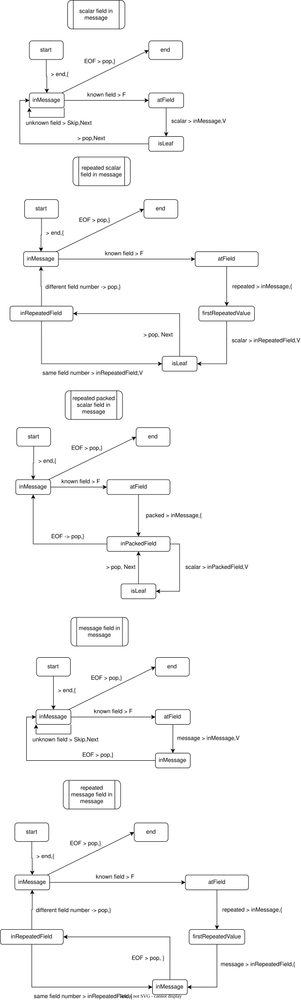

# Notes on implementation of the parser

The pull-based parser's Next and Skip methods are implemented using a stack based parser.
We explain the Next method using some state diagrams.

## Preliminaries

> Diagrams were drawn using [drawio](https://app.diagrams.net/).

The transitions are encoded as:

```
input -> pop/push/noop, emit 
```

Example 1 - a known field key was decoded, so we emit a Field hint and leave the stack untouched:
```
known field key -> F
```

Example 2 - the end offset is reached, so we emit a Leave hint and pop the stack:
```
EOF -> pop, }
```

Example 3 - we are in the repeated field and see another field with the same field number, so we emit a Value hint and push the inRepeatedField onto the stack:
```
same field number -> inRepeatedField, V
```

## Next Scenarios

Instead of drawing one state diagram, we show the state diagrams for the Next method in several scenarios:

* scalar field in message
* repeated scalar field in message
* repeated packed scalar field in message
* message field in message
* repeated message field in message

